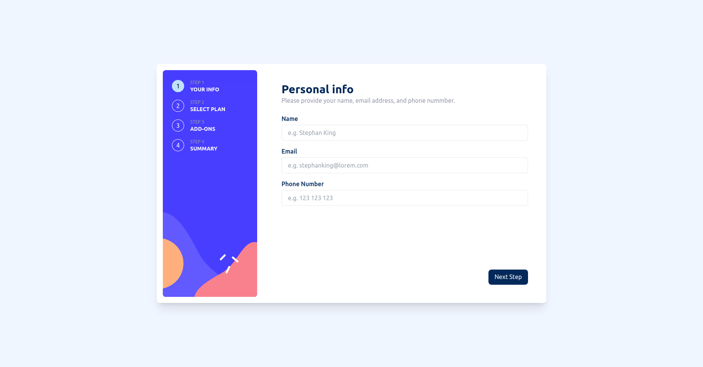

# Frontend Mentor - Multi-step form solution

This is a solution to the [Multi-step form challenge on Frontend Mentor](https://www.frontendmentor.io/challenges/multistep-form-YVAnSdqQBJ). Frontend Mentor challenges help you improve your coding skills by building realistic projects. 

## Table of contents

- [Overview](#overview)
  - [The challenge](#the-challenge)
  - [Screenshot](#screenshot)
  - [Links](#links)
- [My process](#my-process)
  - [Built with](#built-with)
- [Author](#author)

**Note: Delete this note and update the table of contents based on what sections you keep.**

## Overview

### The challenge

Users should be able to:

- Complete each step of the sequence
- See a summary of their selections on the final step and confirm their order
- See hover and focus states for all interactive elements on the page

### Screenshot

### Links

- Solution URL: [https://github.com/fborlido/fm-multi-step-form](https://github.com/fborlido/fm-multi-step-form)
- Live Site URL: [https://fred-multi-step-form.netlify.app/](https://fred-multi-step-form.netlify.app/)

## My process

### Built with

- Semantic HTML5 markup
- Flexbox
- Tailwind css
- Formik
- Yup
- [React](https://reactjs.org/) - JS library

## Author

- Website - [github](https://github.com/fborlido)
- Frontend Mentor - [@fborlido](https://www.frontendmentor.io/profile/fborlido)
